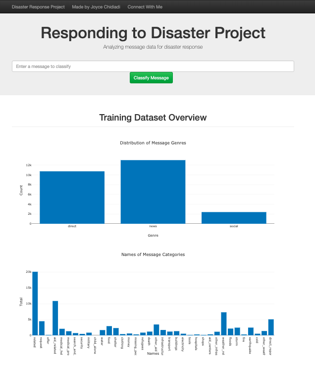
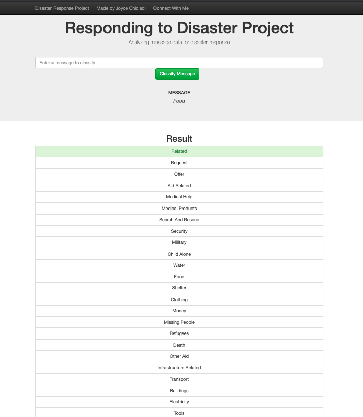

## Motivation
This project focuses on weaving together software engineering, data engineering, machine learning (NLP) skills to produce an end to end data science project. Messages in the form of English texts were extracted, cleaned, transformed and loaded into a SQLite database for creating an ETL pipeline.

The ETL pipeline was used to create a Machine Learning pipeline for a web application where users can enter messages to help sort or understand how best to respond to disaster situations.

## How to use this repository
1. Run the following commands in the project's root directory to set up your database and model.
   - To run ETL pipeline that cleans data and stores in database use: **'python data/process_data.py data/disaster_messages.csv data/disaster_categories.csv data/DisasterResponse.db'**
	 - To run the ML pipeline that trains classifier and saves the model use: **'python models/train_classifier.py data/DisasterResponse.db models/classifier.pkl'**

2. Run the following command in the app's directory to run your web app. 'python run.py'

3. Go to http://0.0.0.0:3001/ to view the web page.
4. My model, 'classifier.pkl' is not included in the models folder here because of its large size. So, you can generate yours by following the above commands.

## Licence:
Training is by Udacity Nanodegree program.

